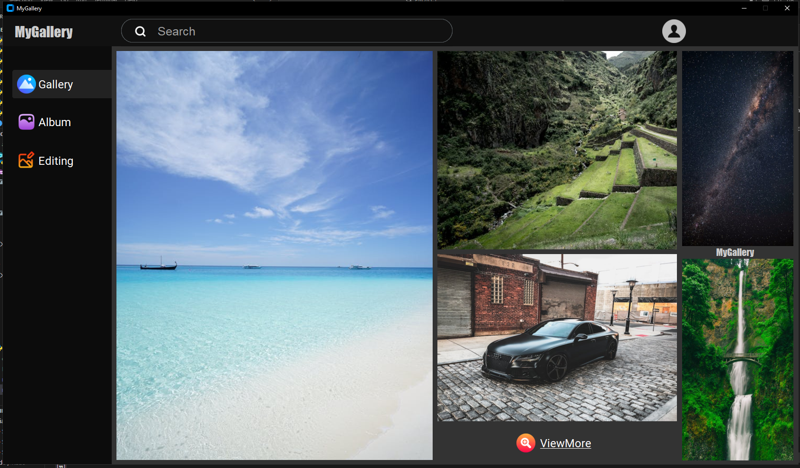

# MyGallery 
 
## Product overview
      This product is my first personal project that completed after about 6 months of learning programming from scratch.

      MyGallery has the same features as regular albums such as image storage and image editing and especially there is a image exhibition area.
## Technologies
      - Python
      - CustomTkinter
      - Sqlalchemy
      - Pillow 
      - numpy
# Note
      - Some features are incomplete
      - If you don't know how to use these features, please read the instructions
      - The application displays most accurately when the screen resolution is 1920x1080 and the scale is 100
# Features 
   ## Authentication interface
      - Sign in
      - Sign up
      - Forgot password (Incomplete)
   ## Main interface
      - Images exhibition area (Click the images to view the changes)
      - View other image exhibitions
      - Search bar (Incomplete)
      - Change the account information
      - Log out
      - Upload images
      - Delete images
      - Edit image
      - Image crop / resize / rotate / flip 
      - Add texts / shapes
      - Image brightness / contrast
      - Image filter
      - Save the changed images

# About the author
   ## Profile
   - Name : LE DINH MINH PHUC
   - YoB : 2007
   - Nationality : Vietnamese
   ## Contact
   - Email : minkhale2011@gmail.com
   - [Facebook](https://www.facebook.com/phuclee1120)
   - [Github](https://github.com/CoderMoiNhu)
# License
This project is licensed under the MIT License - see the [LICENSE](LICENSE) file for details.

    
